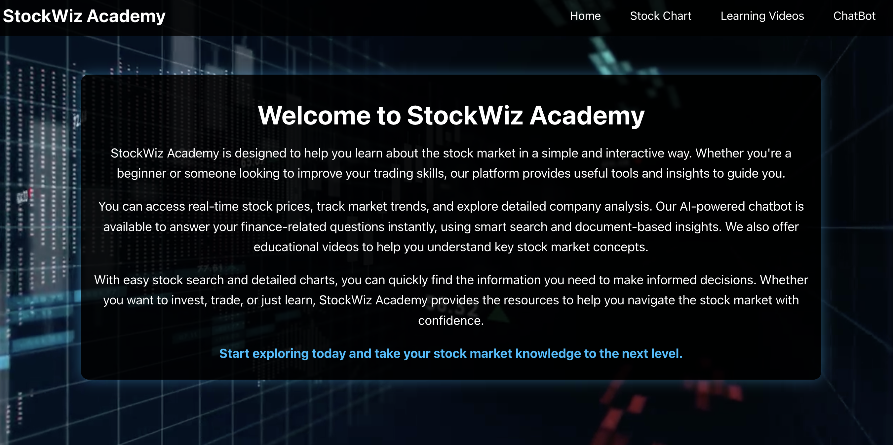
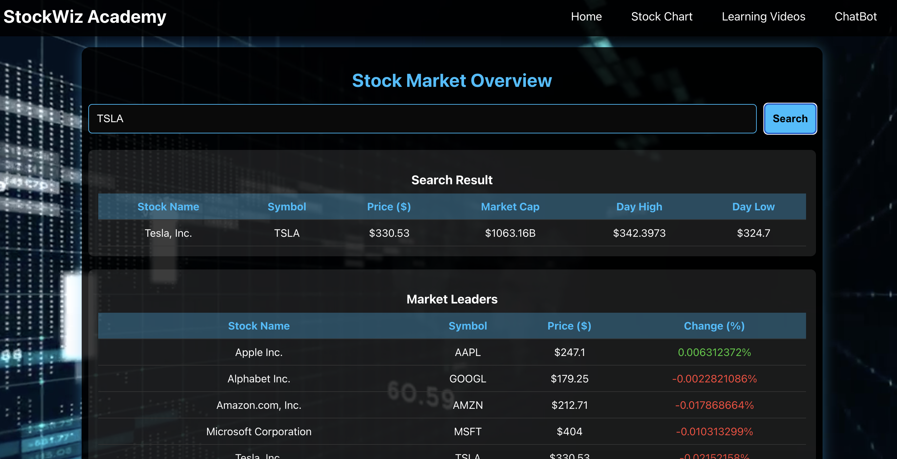
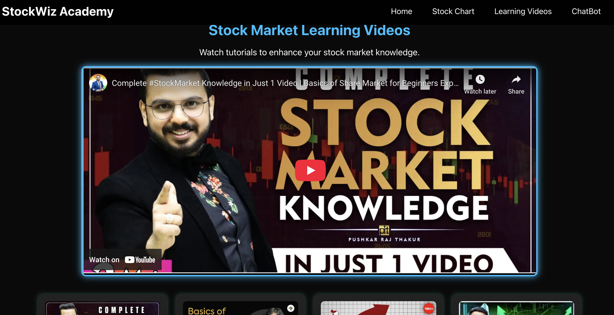
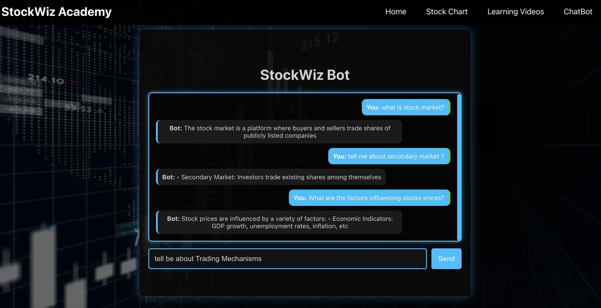

# 📈 StockWiz Academy

StockWiz Academy is an **AI-powered stock market learning platform** that provides:
- **A smart chatbot** that answers stock-related queries using PDFs and Google Gemini AI.
- **Real-time stock market charts** with top stock data visualization.
- **YouTube learning videos** to educate users on stock trading and investing.
- **A sleek, dark-themed UI** with an engaging user experience.

---

## 🛠️ Tech Stack

### **Frontend**
- **ReactJS** – UI development.
- **Axios** – API requests handling.
- **Chart.js** – Stock chart visualization.

### **Backend**
- **Node.js & Express.js** – Handles API requests.
- **MongoDB** – Stores chatbot embeddings and stock data.
- **Yahoo Finance API** – Fetches real-time stock market data.
- **Google Gemini API** – AI-powered chatbot responses.

### **Chatbot (AI-Powered)**
- **FastAPI** (Python) – Manages PDF processing & vector search.
- **Sentence-Transformers** – Converts text into embeddings for similarity search.
- **MongoDB** – Stores embeddings for document retrieval.
- **Google Gemini API** – Answers queries if PDF knowledge is insufficient.

---

## 🚀 Features

### **1️⃣ AI Chatbot with PDF Search & Gemini AI**
- **Extracts knowledge** from **preloaded PDFs** (e.g., stock market guides).
- Uses **vector search** to **find relevant answers** from PDFs.
- **Fallback to Google Gemini AI** for responses when no PDF match is found.

### **2️⃣ Real-Time Stock Market Data**
- Displays **top 12 stocks** on the homepage.
- **Search for any stock** and view **historical charts & live data**.
- Data is sourced using the **Yahoo Finance API**.

### **3️⃣ Stock Market Learning Videos**
- Fetches **top YouTube videos** using the **YouTube API**.
- Displays **titles, thumbnails, and descriptions** for educational content.

### **4️⃣ Dark-Themed UI**
- **Background Video**: `stockmarket.mp4`
- **Neon Blue (`#00BFFF`)** – Highlights, buttons, and links.
- **Electric Green (`#32CD32`)** – Stock market gains & positive indicators.
- **Red (`#FF4136`)** – Stock market losses & alerts.
- **Light Gray (`#D3D3D3`)** – Readable text on a dark background.

---

## 📂 Project Structure

```
stockwiz-academy/
│── frontend/                     # ReactJS Frontend
│   ├── src/
│   │   ├── assets/images/         # UI images
│   │   │   ├── homepage.png
│   │   │   ├── stockchartpage.png
│   │   │   ├── stockWizpage.png
│   │   ├── components/            # Reusable UI components
│   │   ├── pages/                 # Page components (Home, StockChart, etc.)
│   │   ├── App.js                 # Main React component
│   │   ├── index.js               # Entry point
│   ├── public/
│   ├── package.json               # Frontend dependencies
│
│── backend/                       # Node.js Backend
│   ├── server.js                  # Express server
│   ├── routes/
│   ├── controllers/
│   ├── models/
│   ├── .env                        # Environment variables
│   ├── package.json                # Backend dependencies
│
│── chatbot/                        # AI Chatbot (Python)
│   ├── chatbot_api.py              # FastAPI chatbot server
│   ├── embeddings.py               # PDF processing & vector search
│   ├── requirements.txt            # Python dependencies
│
│── README.md                       # Project documentation
```

---

## 💡 How the Chatbot Works

### **1️⃣ PDF Knowledge Base**
- Extracts **text** from a **PDF file**.
- Splits text into **small sentences**.
- Converts sentences into **vector embeddings** (numerical representations).
- Stores embeddings in **MongoDB** for fast retrieval.

### **2️⃣ Query Processing**
- Converts the **user's query into an embedding**.
- Searches for **the most similar document** using a **vector database**.
- Returns **the best-matching response** from PDFs.

### **3️⃣ Fallback to Gemini AI**
- If **no relevant content** is found in the PDFs:
  - **Calls Google Gemini API** for a response.
  - Returns the **AI-generated answer**.

---

## 🏗️ Setup Instructions

### **1️⃣ Clone the Repository**
```sh
git clone https://github.com/your-username/stockwiz-academy.git
cd stockwiz-academy
```

### **2️⃣ Install Dependencies**
#### **Frontend**
```sh
cd frontend
npm install
```

#### **Backend**
```sh
cd ../backend
npm install
pip install -r requirements.txt
```

### **3️⃣ Set Up Environment Variables**
Create a `.env` file inside `backend/` and add:
```
MONGO_URI=mongodb://localhost:27017/stockwiz
GEMINI_API_KEY=your_google_gemini_api_key
YT_API_KEY=your_youtube_api_key
```

### **4️⃣ Run the Application**
#### **Start the Frontend**
```sh
cd frontend
npm start
```

#### **Start the Backend**
```sh
cd backend
node server.js
```

#### **Start the AI Chatbot Server**
```sh
cd chatbot
uvicorn chatbot_api:app --host 127.0.0.1 --port 8003 --reload
```

---

## 📸 Screenshots

### **Homepage**


### **Stock Chart Page**


### **Learning Videos Page**


### **StockWiz Chatbot**


---

## 🤖 API Endpoints

### **1️⃣ AI Chatbot**
| Method | Endpoint | Description |
|--------|----------|-------------|
| `POST` | `/api/chat` | Sends a query to chatbot. |
| `POST` | `/store_pdf` | Stores PDF embeddings in MongoDB. |
| `POST` | `/search` | Searches the PDF knowledge base. |

### **2️⃣ Stocks API**
| Method | Endpoint | Description |
|--------|----------|-------------|
| `GET` | `/api/topstocks` | Fetches top 12 stocks. |
| `GET` | `/api/stock/:symbol` | Fetches individual stock data. |

### **3️⃣ YouTube Learning Videos**
| Method | Endpoint | Description |
|--------|----------|-------------|
| `GET` | `/api/videos` | Fetches top stock market videos. |

---

## 🎯 Future Enhancements
- **Allow users to upload PDFs dynamically** for chatbot knowledge base.
- **Improve chatbot response quality** using fine-tuned embeddings.
- **Add stock portfolio tracking** and market alerts.

---

## 📌 Conclusion
StockWiz Academy combines **AI-powered search, real-time stock data, and learning resources** into an interactive **stock market education platform**.

🚀 **Explore StockWiz Academy and elevate your stock market knowledge!** 🚀
